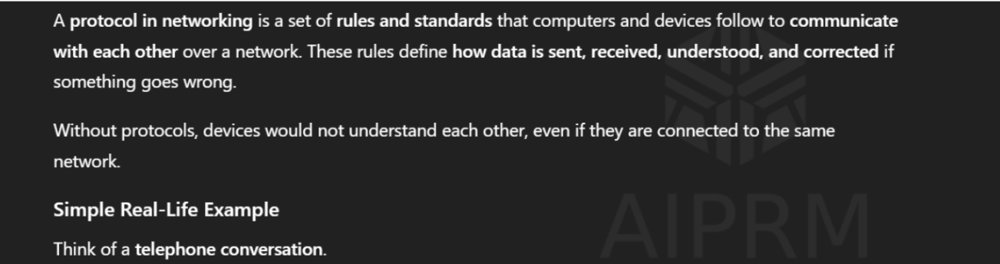
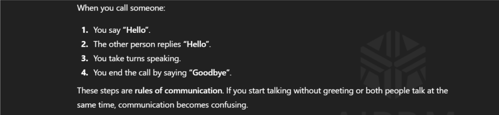
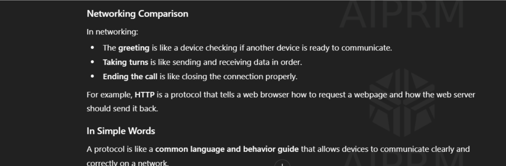
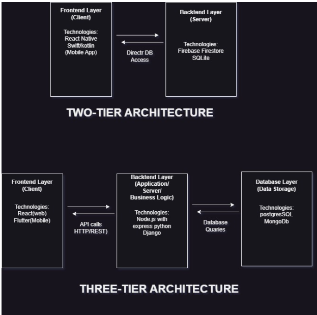
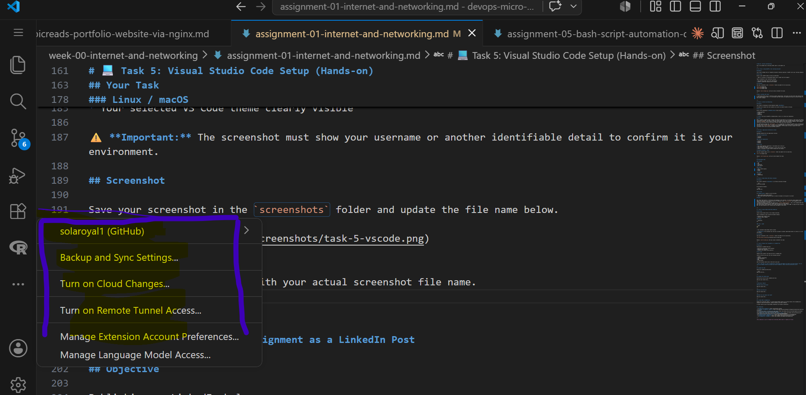
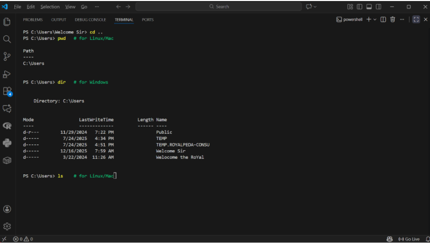

# Week 00 - Internet and Networking

Part of the DevOps Micro Internship (DMI) Cohort 3 with Agentic AI

---

# 🧑‍💻 Task 1: Using ChatGPT as Your Learning Assistant

## Scenario

You're new to DevOps and will frequently encounter technical questions. ChatGPT can be your learning companion.

## Your Task

Write a clear ChatGPT prompt to help you understand:

> "What is a protocol in networking? Explain with a simple real-life example."

Take a screenshot of your interaction showing:

* Your detailed prompt (with clear expectations)
* ChatGPT's simplified response with an example

## Screenshot

Save your screenshot in the `screenshots` folder and update the file name below.






Replace `task-1-chatgpt.png` with your actual screenshot file name.

---

## What I Learned (2–3 lines)

I learned that there can be a connection without communication, which does not profit both sides because they do not understand each other. It is profitable when both sides can communicate and give an accurate answer to each other's prompts.


---

# 🌐 Task 2: Internet and Networking

## Scenario

Your friend is launching an online bookstore named **EpicReads**.

He asked you to explain how users globally can access his website hosted in Finland.

## Your Task

Write a short explanation (**100–150 words**) that includes:

* Packet Switching
* IP Address
* TCP/IP
* HTTP/HTTPS

💡 **Tip:** You may use ChatGPT (as demonstrated in Task 1) to refine your explanation.

## Answer

When a customer in Nigeria opens a browser and types www.epicreads.com, the request is sent across the internet using packet switching. The data is broken into small packets that travel through different networks until they reach the `EpicReads` server hosted in Finland. Each packet contains the server’s IP address, which uniquely identifies the Finland server and ensures the data reaches the correct destination.

The communication follows the `TCP/IP model`. `IP` is responsible for routing the packets across countries and networks, while TCP makes sure all packets arrive completely and in the correct order. To display the website, the browser uses `HTTP or HTTPS` to request the web pages. HTTPS encrypts the data, keeping the user’s information secure while accessing EpicReads globally.

---

# 🏗️ Task 3: Application Architecture & Stack

## Scenario

EpicReads bookstore has two application versions:

### Two-Tier Application

* Frontend
* Database

### Three-Tier Application

* Frontend
* Backend
* Database

## Your Task

* Draw simple diagrams (hand-drawn or tool-based such as draw.io)
* Label each layer clearly
* List at least two common technologies or tools used for each layer
* Submit a screenshot or photo clearly showing your own drawing

## Diagram Screenshot / Photo

Save your diagram image in the `screenshots` folder and update the file name below.




Replace `task-3-diagram.png` with your actual diagram file name.

---

## Technologies Used

### Frontend

* HTML
* CSS 
* JavaScript
* React Native

### Backend

* Node.js Wwith express
* Python
* Django

### Database

* MongoDB
* PostgressSQL

---

# 🌍 Task 4: Domain Name & DNS (Basic Concepts)

## Scenario

Your friend's bookstore **EpicReads** is currently accessible through:

```text
52.172.142.222:3000
```

He purchased the domain:

```text
epicreads.com
```

## Your Task

In **50–100 words**, explain in your own words:

1. What is DNS (Domain Name System)?
2. Which DNS record type should be used to connect the domain to the given IP, and why?

## Answer


DNS (Domain Name System) is essentially the phonebook of the internet. It translates human-readable domain names (like epicreads.com) into the numerical IP addresses (like `52.172.142.222`) that computers use to identify each other on the network.
To connect the domain to the IP, you should use an `A Record (Address Record)`. This is the standard DNS record type specifically designed to map a domain name directly to an IPv4 address.
Note: DNS resolves the IP address, but it does not handle port numbers like :3000. To remove the port from the URL, you would typically use a reverse proxy like Nginx on the server.


---

# 💻 Task 5: Visual Studio Code Setup (Hands-on)

## Your Task

Install Visual Studio Code (if not already installed).

Take a screenshot of your VS Code environment showing:

* Terminal open inside VS Code
* Running a basic command:

### Windows

```powershell
dir
```

### Linux / macOS

```bash
pwd
ls
```

* Your selected VS Code theme clearly visible

⚠️ **Important:** The screenshot must show your username or another identifiable detail to confirm it is your environment.

## Screenshot

Save your screenshot in the `screenshots` folder and update the file name below.





Replace `task-5-vscode.png` with your actual screenshot file name.

---

# 🔗 Task 6: Publish Your Assignment as a LinkedIn Post

## Objective

Publishing on LinkedIn helps you:

* Build your professional online presence
* Reinforce your learning
* Document your DevOps journey publicly

## Your Task

Summarize your answers from Tasks 1–5 into a LinkedIn post.

Clearly structure your post into the following sections:

* ChatGPT
* Internet & Networking
* App Architecture
* DNS
* VS Code Setup

Add the following credit note at the end of your post:

> **P.S. This post is a part of DevOps Micro Internship with Agentic AI Cohort-3 by Pravin Mishra. You can start your DevOps journey by joining this Discord community: https://discord.pravinmishra.com/**

---

## LinkedIn Post URL

Paste your LinkedIn post URL here:

```text
https://www.linkedin.com/posts/solaibinuolapo_homepage-activity-7414412360020631552-vOmb?utm_source=social_share_send&utm_medium=member_desktop_web&rcm=ACoAADUrROwBSs3BHxwzwdeWVUk2kf9iszgkWjM
```

---

## LinkedIn Post Backup Copy

Paste the full text of your LinkedIn post here:

🚀 Understanding the Basics of Internet, Networking & Application Architecture, etc.

Learning complex tech concepts becomes easier when broken down into simple explanations. Tools like ChatGPT help explain networking, internet communication, and system design in a clear, beginner-friendly way, making learning more accessible for students and professionals.

Internet & Networking
When users around the world access a website like EpicReads, their requests travel across the internet using packet switching. Each device uses an IP address for identification, while TCP/IP ensures data is delivered accurately and in order. HTTP/HTTPS allows browsers to request and securely receive web content, enabling global access regardless of location.

Application Architecture 
We explored two ways to structure the EpicReads app:
Two-Tier (MVP): Great for speed. Frontend talks directly to a BaaS like Firebase.
Three-Tier (Scalable): The industry standard. We separated concerns into Frontend (React/Flutter), Backend (Node.js/Django), and Database (PostgreSQL). This adds security and better logic handling.

🌐DNS (Domain Name System) is essentially the phonebook of the internet. It translates human-readable domain names (like epicreads.com) into the numerical IP addresses (like 52.172.142.222) that computers use to identify each other on the network.
A Record: The specific record used to map our domain to the server's IP address.

Reverse Proxy: We discussed using Nginx to forward traffic from port 80 to 3000, so users don't have to type ugly port numbers in the URL!

💻 VS Code Setup To build this efficiently, a solid dev environment is key. My VS Code is geared up with:
Prettier & ESLint: For clean, consistent code.
Thunder Client: for testing APIs directly in the editor.

P.S. This post is part of the FREE DevOps Micro Internship Cohort run by Pravin Mishra. You can start your DevOps journey for free from his YouTube Playlist.

hashtag#DevOps hashtag#LearningJourney hashtag#Tech

---

# Reflection – Week 0

### What did you find easy?

Everything I did, i already have a little knowledge about the information requested for, so it is like i am reversing

---

### What was difficult?

Nothing, I could not even think of any difficulty at all
---

### What will you improve next week?

To act faster, and improvement my speed. To stop proscatination

---

## 📌 About DMI & CloudAdvisory

DevOps Micro Internship (DMI) is a project-based DevOps program run by Pravin Mishra (The CloudAdvisory) focused on real-world execution, systems thinking, and career readiness.

It helps learners build strong DevOps foundations with hands-on experience.


## 📌 Resources

- 🌐 **DMI Official Website:** https://pravinmishra.com/dmi  
- 🎓 **DevOps for Beginners (Udemy):** https://www.udemy.com/course/devops-for-beginners-docker-k8s-cloud-cicd-4-projects/  
- 🎓 **Ultimate Agentic AI DevOps with Clude Code** https://www.udemy.com/course/ultimate-agentic-ai-devops-with-claude-code/?referralCode=448389767BC96284087B
- 🎓 **DevOps with Claude Code: Terraform, EKS, ArgoCD & Helm** https://www.udemy.com/course/devops-with-claude-code-terraform-eks-argocd-helm/?referralCode=1C5B734505D65A010FA3
- ▶️ **YouTube Playlist (DMI Cohort 3):** https://www.youtube.com/playlist?list=PLFeSNDtI4Cho  
- 🔗 **Pravin Mishra (LinkedIn):** https://www.linkedin.com/in/pravin-mishra-aws-trainer/  
- 🏢 **CloudAdvisory (LinkedIn):** https://www.linkedin.com/company/thecloudadvisory/

---

*This submission is part of DevOps Micro Internship (DMI) Cohort 3 — Agentic AI Track*