# Assignment 7 — AI-Assisted AWS Security and Cost Audit

Part of the DevOps Micro Internship (DMI) Cohort 3 with Agentic AI

---

## Purpose

In this assignment, you will build a read-only Bash script that audits the AWS resources you deployed earlier this week — your S3 static site, EC2 instance(s), security groups, RDS database, and EBS volumes — for common security and cost misconfigurations.

You will then connect that script to Claude Code as a reusable `/aws-audit` skill that explains what it found and recommends a fix, without ever making the fix itself.

Finally, you will find a real misconfiguration in your own account, apply the fix yourself, and prove it worked with a second audit run.

---

# Task 1 — Confirm Your AWS Resources and Set Up Your Workspace

## Goal

Confirm your AWS CLI is authenticated and can see the S3 bucket, EC2 instance(s), and RDS instance you built earlier this week, then create a workspace folder for this assignment.

### Evidence

#### Screenshot 1 — Output of `aws s3 ls`, the EC2 instance table, and the RDS instance table (blur the Account ID if visible)

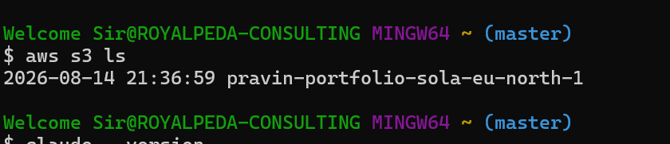

---

#### Screenshot 2 — Output of `pwd` and `find . -maxdepth 4 -type d | sort`

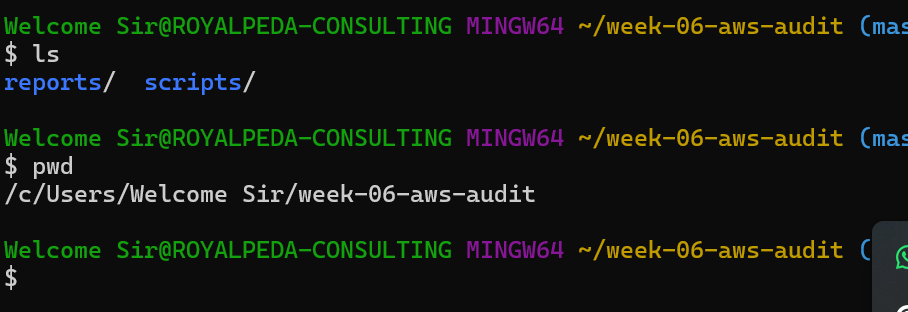

---

### Notes You Must Write (Very Important)

**1. Which resources from this week's earlier assignments did you see in the listings?**

I saw the S3 bucket, ec2 book review running, amd rds for it.

**2. Why must you confirm your resources exist before writing an audit script against them?**

We need some resources to confirm the audit the Claude Ai wants to do.

---

# Task 2 — Define Safety Rules in CLAUDE.md

## Goal

Create a `CLAUDE.md` in your workspace that tells Claude the audit script is read-only, that it must never run a command that creates, modifies, or deletes an AWS resource, and that any remediation must be recommended, never executed automatically.

### Evidence

#### Screenshot 3 — `CLAUDE.md` open in VS Code showing all four sections

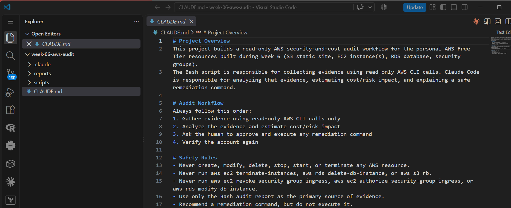

---

### Notes You Must Write (Very Important)

**1. Why should Claude never be given permission to run `revoke-security-group-ingress` itself, even if the fix is obviously correct?**

Because Ingress is a critical place in Security group, it allows traffic into the resources. the traffic that must be allow to come in must be defined. so, if claude is giving permission to do that it can affect or do the one is not meant to do.

**2. Which rule prevents Claude from claiming a finding that the report does not support?**

`Safety Rules`: Never run aws ec2 revoke-security-group-ingress, aws ec2 authorize-security-group-ingress, or aws rds modify-db-instance.

---

# Task 3 — Plan the Audit with Claude Code

## Goal

Ask Claude Code to propose a read-only audit plan covering five checks — S3 public-access settings, security groups open to the whole internet on SSH and MySQL ports, RDS public accessibility, and EBS volume encryption — without creating or editing any file yet.

### Evidence

#### Screenshot 4 — Claude Code showing the five-check plan

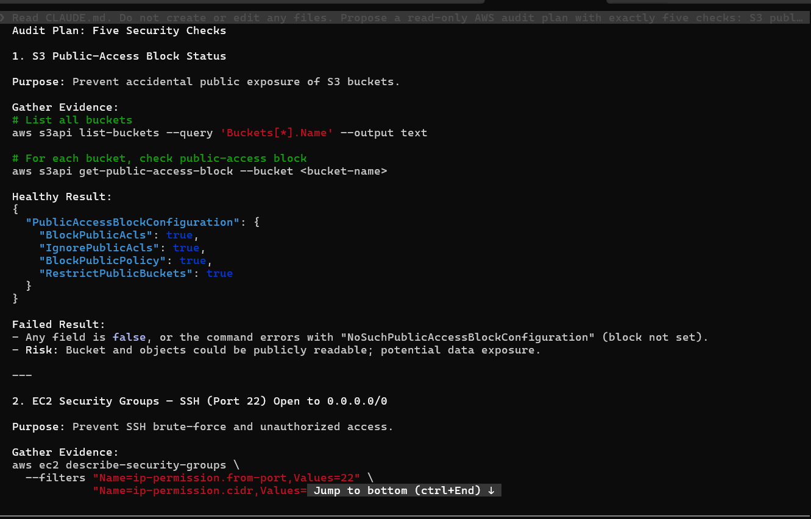
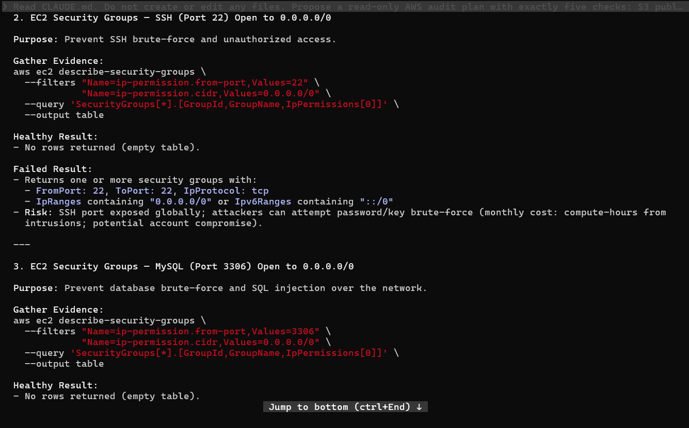
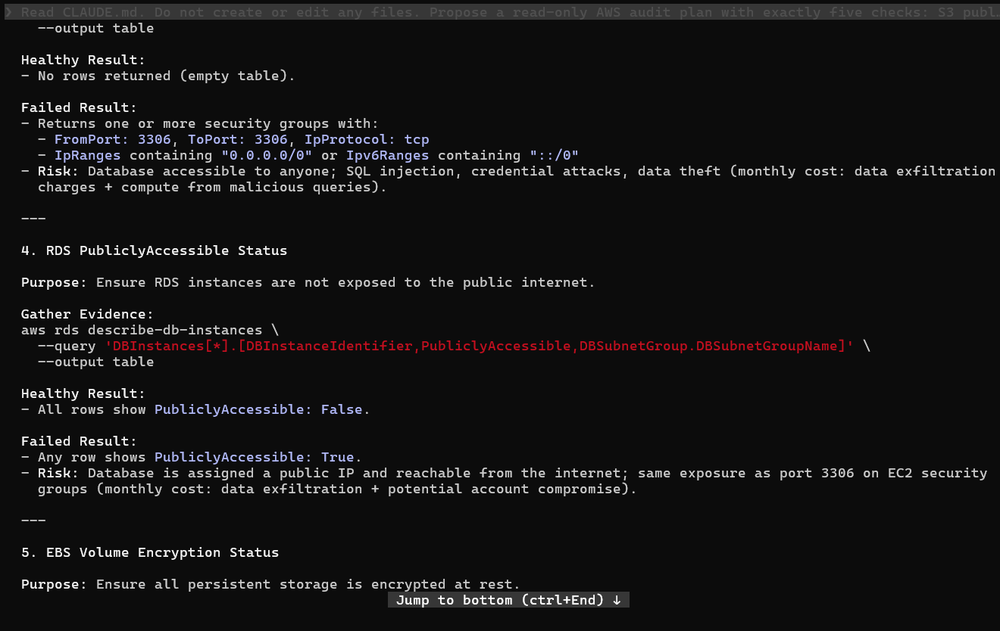
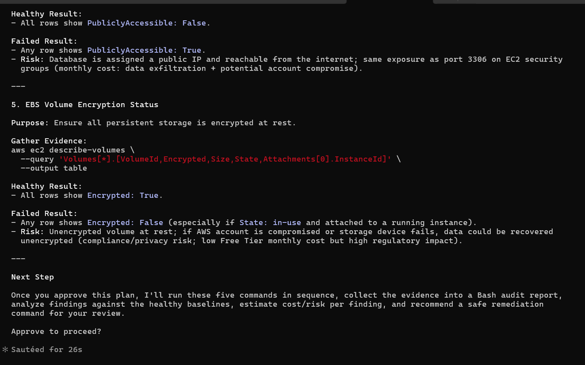

---

### Notes You Must Write (Very Important)

**1. Which part of this task represents the Gather phase?**

the Audit Workflow do the gathering of information, it only read and gather and it does not perform any other functions

**2. Did every proposed command start with `describe-`, `get-`, or `list-`? Why does that matter?**

the three commands does not do any harm to the resources, `describe` only tell what is there, `get` only show what is there, while `list` omly mention them as seen. none has anything to do with execution or deletion or revoke things 

---

# Task 4 — Build the AWS Audit Script

## Goal

Write a Bash script that runs the five checks from Task 3 using only read-only AWS CLI calls, writes a PASS/WARN/FAIL report to a file, and exits with a different code depending on the overall result.

Make it executable and confirm it has no syntax errors.

### Evidence

#### Screenshot 5 — Top section of `aws-audit.sh` showing the variables and the checks array

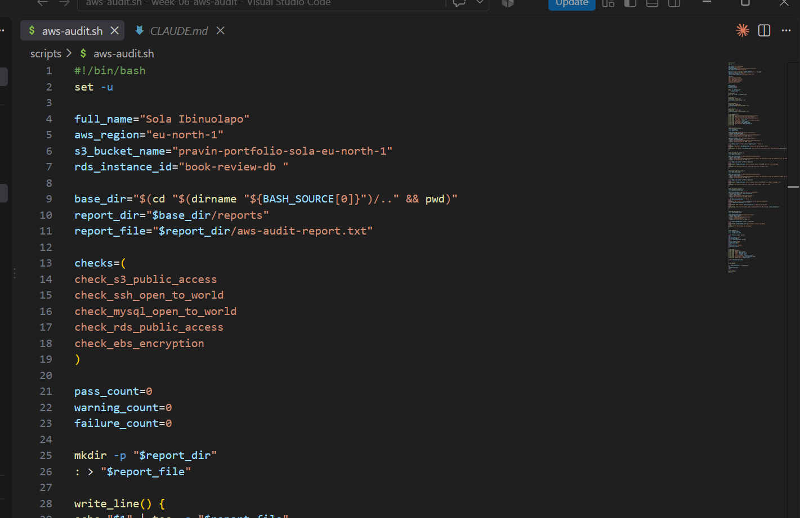

---

#### Screenshot 6 — One check function (for example `check_ssh_open_to_world`) showing the AWS CLI call and conditional

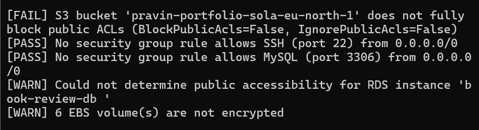

---

#### Screenshot 7 — Output of `bash -n scripts/aws-audit.sh` and `ls -l scripts/aws-audit.sh`

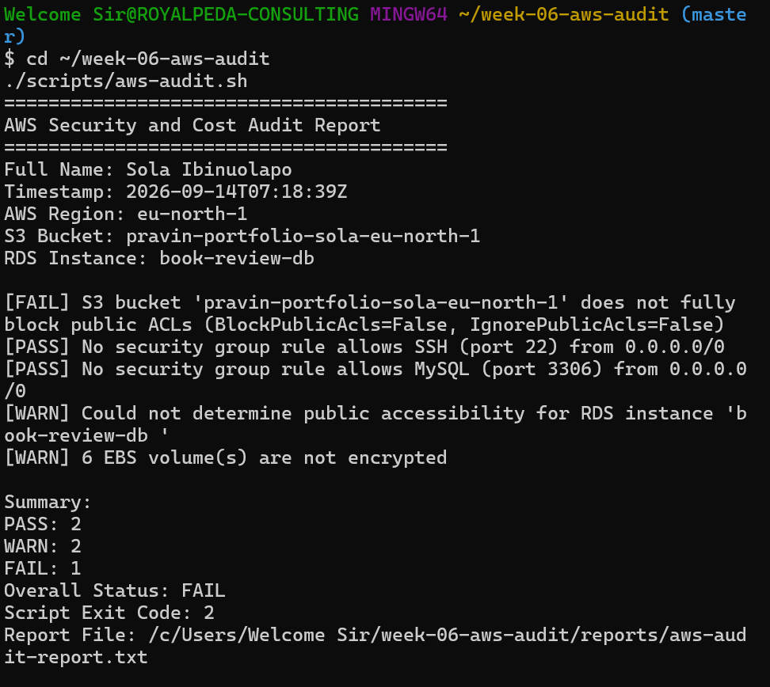

---

### Notes You Must Write (Very Important)

**1. What is stored in the checks array, and how does the loop use it?**

The checks array stores string names of the Bash functions defined in the script (check_s3_public_access, check_ssh_open_to_world, etc.).

The for check_function in "${checks[@]}" loop iterates through the array and dynamically executes each function by calling "$check_function". This design makes the script modular, you can add, remove, or reorder audit checks simply by modifying the array without touching the execution logic.

**2. Why does every AWS CLI call in this script use `--query` and `--output text` instead of parsing raw JSON?**

Direct filtering (--query): Uses JMESPath expressions to extract only the specific field or array length needed directly from the AWS API response, eliminating the dependency on external tools like jq.

Clean Bash values (--output text): Returns raw, plain-text strings or numbers instead of JSON-formatted data (which includes quotes, braces, and line breaks). This allows Bash to instantly perform string comparisons ([ "$block_acls" = "True" ]) or numerical logic ([ "$open_rule_count" -gt 0 ]) without extra string scrubbing.

**3. Why does the script use different exit codes for HEALTHY, WARN, and FAIL?**

CI/CD & Automation Integration: Exit codes allow parent processes, cron jobs, or CI/CD pipelines (such as GitHub Actions or Jenkins) to programmatically determine the status of the run without needing to parse text logs.

---

# Task 5 — Run the Baseline Audit

## Goal

Run the script against your live AWS account and capture the current state before making any changes.

### Evidence

#### Screenshot 8 — Output of `./scripts/aws-audit.sh` showing your Full Name and all five checks

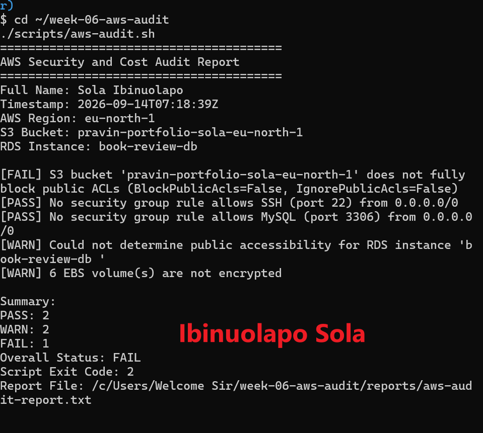

---

#### Screenshot 9 — Output showing the captured exit code and final summary

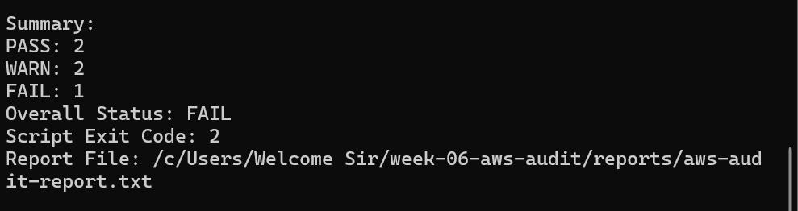

---

### Notes You Must Write (Very Important)

**1. What is the overall status of your baseline audit?**

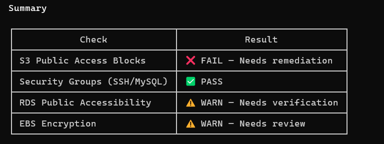

**2. Did any check return FAIL or WARN? If so, which one, and what evidence did it show?**

 S3 Public Access Blocks shows `FAIL`, because the public ACLs is not fully blocked and something unexpected can happen to it.

EBS Encryption shows `WARN`, Evidence from report it shows [WARN] EBS volume(s) are not encrypted. it expose data if the instance is compromised or the volume is detached and accessed elsewhere
  
RDS Public Accessibility shows `WARN`, Evidence from report shows that [WARN]
Could not determine public accessibility for RDS instance 'book-review-db. the audit could not verify if it is open to public or not

**3. If every check passed, what does that tell you about the security posture of your account so far?**

it indicates that my account has successfully established a strong baseline security posture for the specific resources and rules evaluated by the script

---

# Task 6 — Build and Run the /aws-audit Skill

## Goal

Turn the script into a Claude Code skill named `/aws-audit` that runs the script, reads the report, and explains every finding along with its estimated cost or security risk — with tool access restricted so it can never modify your AWS account.

### Evidence

#### Screenshot 10 — `SKILL.md` showing the frontmatter, tool restrictions, and safety rules

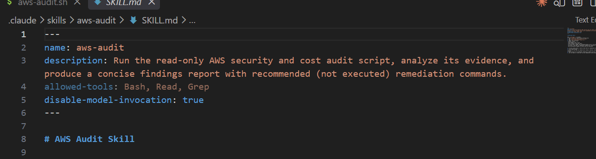

---

#### Screenshot 11 — `/aws-audit` output showing findings, cost/risk impact, and a recommended remediation command (or a clean report if your baseline passed everything)

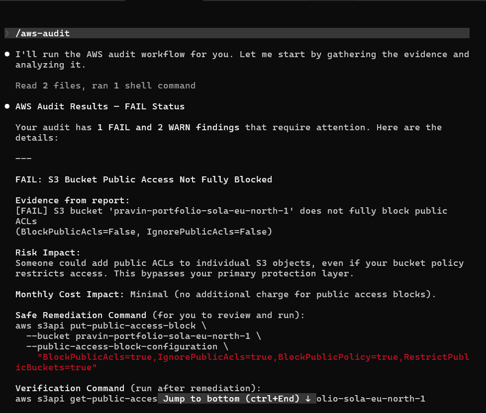
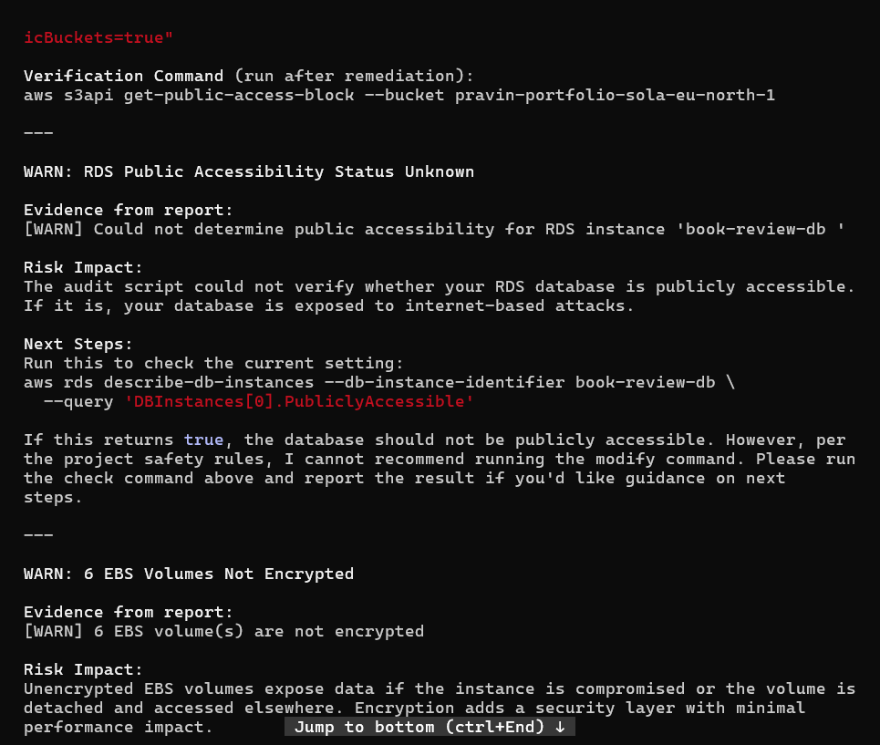
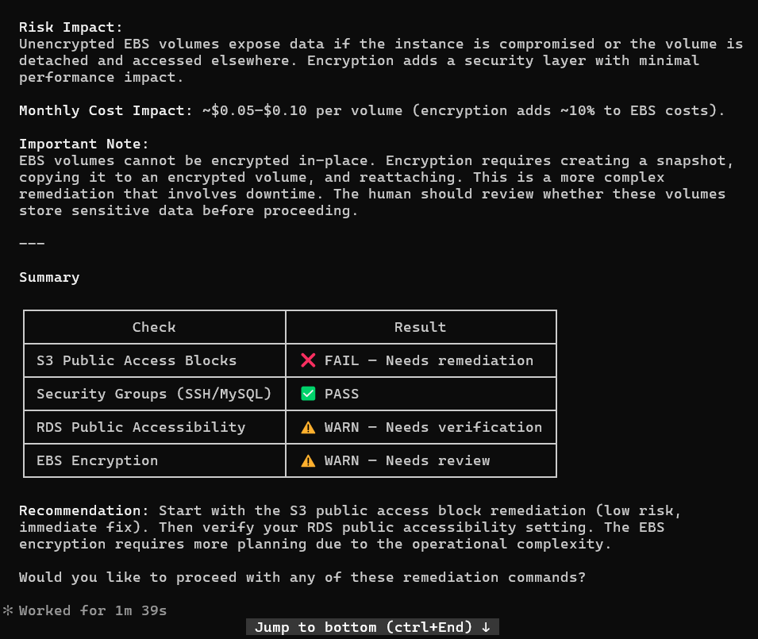

---

### Notes You Must Write (Very Important)

**1. Why does this skill have Bash, Read, and Grep, but not Write?**

Restricting the skill to `read-only` capabilities prevents the AI from accidentally modifying files, corrupting codebases, or executing unauthorized state changes on your cloud environment.

Audit skills are designed for assessment, not autonomous mutation. Excluding `Write` ensures that remediation steps (like altering S3 bucket configurations) are presented as recommendations for human approval rather than executed without oversight.

**2. What part is performed by Bash, and what part is performed by Claude?**

Bash: Interacts directly with the operating system and AWS CLI to execute commands, read logs from disk, filter text (grep), and retrieve deterministic raw state data.

Claude (Analysis & Synthesis): Processes raw command outputs, identifies root causes (like syntax typos or missing variables), translates exit codes into human-readable tables, evaluates security trade-offs, and guides you through remediation

**3. Why is estimating cost/risk impact something the AI adds on top of a plain PASS/FAIL script?**

Shell scripts only perform boolean checks `(e.g., True vs False)`. They lack the domain context to explain business consequences or operational trade-offs.

Adding risk severity `e.g. exposed data vs. potential downtime` and cost impacts for example, free S3 block changes vs. EBS snapshot costs, helps teams triage findings—enabling them to prioritize critical fixes over low-risk warnings based on financial and operational impact.

---

# Task 7 — Fix a Real Finding and Re-Verify

## Goal

Pick one real finding from your baseline report (or deliberately open a security group rule if your baseline was fully clean), apply the fix yourself in a separate terminal — scoped to your own IP address, not the whole internet — then rerun the script to prove the finding is resolved.

### Evidence

#### Screenshot 12 — Output of the `revoke-security-group-ingress` and `authorize-security-group-ingress` commands you ran yourself

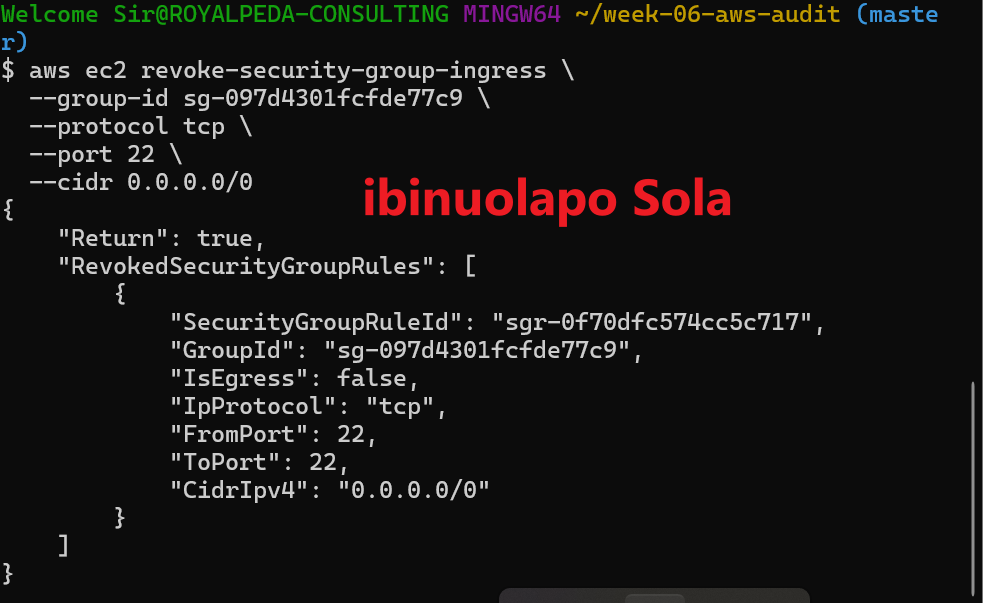
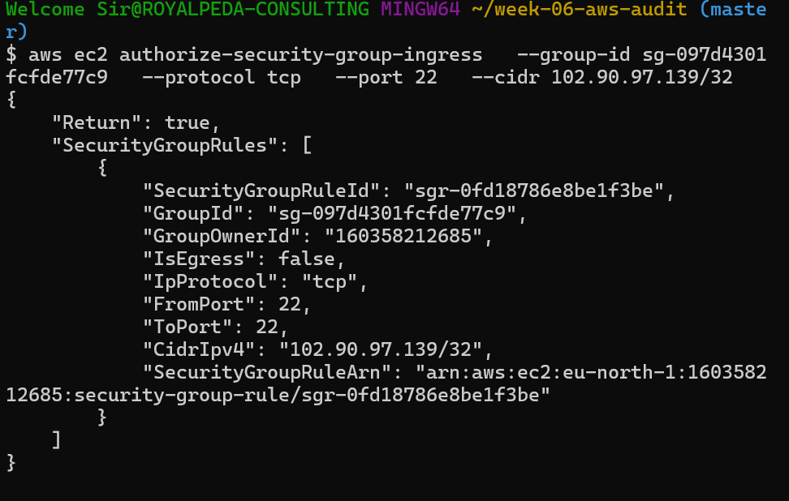
---

#### Screenshot 13 — Rerun of `./scripts/aws-audit.sh` showing the finding is now PASS

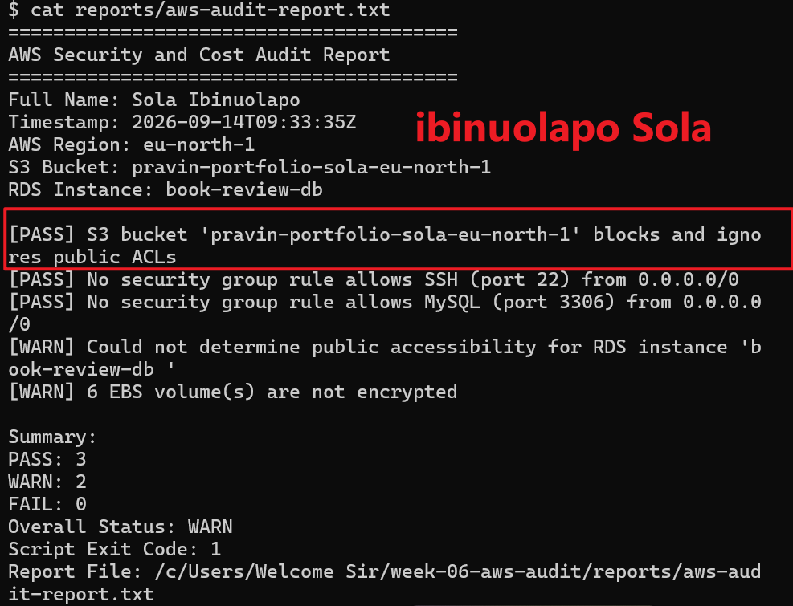

---

### Notes You Must Write (Very Important)

**1. Which exact finding did you fix, and what command did you run?**

I fixed ther s3 bucket that was open to the public using the recommended commands.

**2. Why did you scope the new rule to your own IP address instead of leaving it open to `0.0.0.0/0`?**

we scope it to not allow unathorised access

**3. Did Claude execute the remediation command, or did you? Why does that matter?**

Claude did not execute any commands but i did on the instruction to make sure the security of my resources are in good places. 

**4. Which phase of the Agentic Loop does the Bash script represent? Which phase does Claude's explanation represent? Which phase is you running the fix?**

Bash Script Execution: Observation / Data Gathering (Tool Execution)
The script acts as the environment's sensing mechanism, querying AWS APIs to collect raw, objective state data and security metrics.

Claude's Explanation: Reasoning / Analysis
This represents the cognitive processing phase where raw data is interpreted, risks and costs are evaluated, and actionable solutions are structured.

Running the Fix: Action / Remediation
This represents the execution phase where decisions are acted upon, directly altering the system's state to bring the environment into compliance.

---

# LinkedIn Post (Required)

## Goal

Create a LinkedIn post including:

- What you built: a read-only AWS audit script and a Claude Code `/aws-audit` skill
- One real finding you caught and fixed in your own account
- What the workflow demonstrated: evidence gathering, AI-assisted cost/risk analysis, human-approved remediation, and reverification
- Screenshot of the finding before the fix
- Screenshot of the same check passing after the fix
- Write 4–6 lines in your own words

Suggested tags:

`#DMIByPravinMishra #AWS #AgenticAI #ClaudeCode #DevOps`

### Evidence

#### LinkedIn Post URL

Paste your LinkedIn post URL here:

https://www.linkedin.com/posts/solaibinuolapo_aws-devops-cloudsecurity-activity-7506816578487889920-R2OR?utm_source=share&utm_medium=member_desktop&rcm=ACoAADUrROwBSs3BHxwzwdeWVUk2kf9iszgkWjM
---

#### Screenshot of Published LinkedIn Post

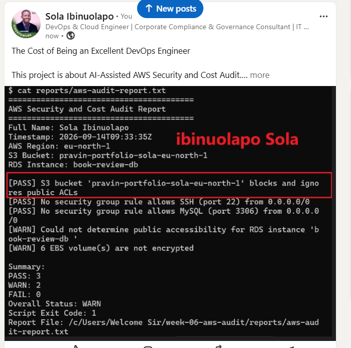

---

# Submission Instructions

Complete all tasks in sequence.

Your submission must include:

- All 13 required task screenshots
- Answers to every **Notes You Must Write** question
- `CLAUDE.md`
- `scripts/aws-audit.sh`
- `.claude/skills/aws-audit/SKILL.md`
- `reports/aws-audit-report.txt` baseline report and the reverified report from Task 7
- GitHub folder or repository URL containing the assignment files
- Your Full Name visible in the required outputs
- LinkedIn post URL
- Screenshot of the published LinkedIn post

Submit only a Google Doc link.

Add the GitHub URL inside the Google Doc.

Follow the Assignment Submission Guidelines.

---

# Completion Checklist

- [ ] Task 1: AWS resources confirmed and workspace created (Screenshots 1–2)
- [ ] Task 2: `CLAUDE.md` created with project context and safety rules (Screenshot 3)
- [ ] Task 3: Claude produced a read-only five-check audit plan before any script existed (Screenshot 4)
- [ ] Task 4: `aws-audit.sh` built, executable, and passes `bash -n` (Screenshots 5–7)
- [ ] Task 5: Baseline audit captured and saved with Full Name visible (Screenshots 8–9)
- [ ] Task 6: `/aws-audit` skill loads and runs successfully with no Write permission (Screenshots 10–11)
- [ ] Task 7: A real finding was fixed by you and reverified as PASS (Screenshots 12–13)
- [ ] Skill never executed a remediation command
- [ ] New security group rule is scoped to your own IP, not `0.0.0.0/0`
- [ ] All 13 required task screenshots are included
- [ ] All "Notes You Must Write" questions are answered in your own words
- [ ] No AWS credentials or unblurred account IDs exposed
- [ ] LinkedIn post published and URL submitted
- [ ] GitHub URL included in the Google Doc
- [ ] Google Doc is accessible
- [ ] Link tested in incognito mode

---

# Final Submission

Submit only your Google Doc link.

### Question

Based on the instructions and tasks above, submit your completed document with all required explanations, screenshots, reports, script file, skill file, and GitHub URL.

https://docs.google.com/document/d/1rDuZKbHA9cFT3xeb0hYhKhInhmbXUFL9kxl7340RLa8/edit?usp=sharing

---

## 📌 About DMI & CloudAdvisory

DevOps Micro Internship (DMI) is a project-based DevOps program run by Pravin Mishra (The CloudAdvisory) focused on real-world execution, systems thinking, and career readiness.

It helps learners build strong DevOps foundations with hands-on experience.

---

## 📌 Resources

- 🌐 DMI Official Website: https://dmi.pravinmishra.com?utm_source=github&utm_medium=readme  
- 🎓 University: https://university.pravinmishra.com?utm_source=github&utm_medium=readme  
- 💬 Discord Community: https://discord.pravinmishra.com?utm_source=github&utm_medium=readme  
- 📝 Blog: https://dmi.pravinmishra.com/blog?utm_source=github&utm_medium=readme  
- ▶️ YouTube Playlist: https://www.youtube.com/playlist?list=PLFeSNDtI4Cho  
- 🔗 Pravin Mishra (LinkedIn): https://www.linkedin.com/in/pravin-mishra-aws-trainer/  
- 🏢 CloudAdvisory (LinkedIn): https://www.linkedin.com/company/thecloudadvisory/

---

*This submission is part of DevOps Micro Internship (DMI) Cohort 3 — Agentic AI Track.*